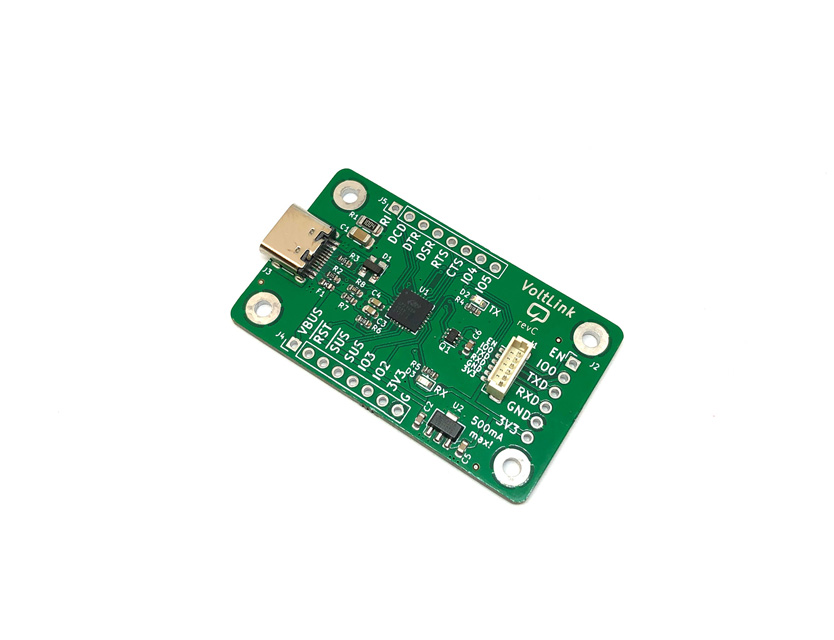

# VoltLink™
VoltLink™ is a USB to serial adapter board based on the popular CP2102N chip with built-in ESP32 auto-reset circuitry. When compared to the cheap modules you can get from Aliexpress this adapter is reliable & flexible at the same time. Reliable because it's based on a well known usb to serial adapter chip sourced from a known supplier and flexible because you have the ESP32 IO & EN pin auto-reset circuit built-in so there is no need to implement this on the target board.

Another advantage of the VoltLink is the built-in 3.3V 500mA low dropout regulator capable of powering the device your are programming. Optionally you can connect a custom JST cable that alows programming of Shelly relays safely, without mains power. This makes the VoltLink one of the best usb/serial adapters to flash your devices with Tasmota or ESPHome.

You have the option of connecting through the VoltLink connector which is a JST-SH 1.0mm pitch 6 pin connector that saves space on the target board or via standard 0.1 inch pin header. 

If you would like to order one of these adapters ready assembled, check out my [Tindie store](https://www.tindie.com/products/23076/).

More info about this project in [Voltlog #405](https://youtu.be/4uZt7zaJOnc).

